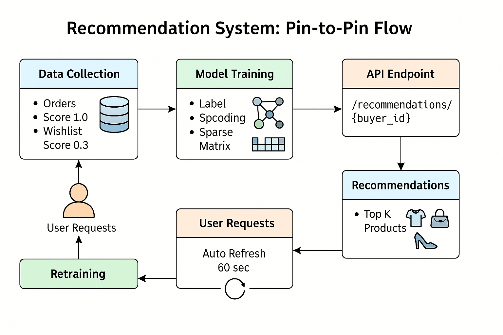

# Personalized Product Recommendation API

This project provides a recommendation engine using user interaction data such as orders, cart activity, and wishlist entries. It uses collaborative filtering (via matrix factorization) to suggest products tailored to each user.

## Features

- Trains on real buyer-product interactions (orders, cart, wishlist)
- Periodic retraining to keep recommendations up to date
- Fast API server for serving recommendations
- Customizable number of recommendations with `top_k` parameter

## Techniques Used

- **Collaborative Filtering**: Using `TruncatedSVD` from Scikit-learn to perform matrix factorization on the user-product interaction matrix.
- **Implicit Feedback Scoring**:
  - Orders are given a weight of `1.0`
  - Cart additions have a weight of `0.5`
  - Wishlist adds have a weight of `0.3`
- **Label Encoding**: User and product IDs are encoded into numeric indices to build the interaction matrix.
- **Sparse Matrix Representation**: The buyer-product matrix is stored as a sparse matrix to save memory and improve performance.
- **Auto-Retraining**: Background thread runs at a fixed interval (default: 60 seconds) to retrain the model using fresh interaction data.

## API Endpoints

### `GET /recommendations/{buyer_id}`

Returns a list of product IDs recommended for the given buyer.

**Query Parameters**:

- `top_k` (optional, default=5): Number of recommendations to return.

**Response Example**:

```json
{
  "recommended_products": [
    {
      "id": "product_id",
      "name": "Name",
      "description": "",
      "price": 2000.0,
      "wholesalePrice": 0.0,
      "minOrderQuantity": 00,
      "availableQuantity": 000,
      "images": ["image.png"],
      "isDraft": false,
      "status": "DRAFT",
      "stockStatus": "IN_STOCK",
      "rating": 0.0,
      "reviewCount": 0,
      "dimensions": null,
      "material": null,
      "artistName": null,
      "certifications": null,
      "rarity": null,
      "label": null,
      "techniques": null,
      "color": null,
      "fabricType": null,
      "fabricWeight": null,
      "fitType": null,
      "discount": 4.0,
      "deliveryCost": 40.0,
      "certificateIssueDate": null,
      "galleryCertificateName": null,
      "sellerId": "sellerId",
      "categoryId": "",
      "pickupAddressId": null,
      "createdAt": "2025-03-22T04:18:12.293000",
      "updatedAt": "2025-03-22T04:18:12.293000",
      "attributes": {
        "Fit Type": "fine",
        "Material": "nylon",
        "Technicsw": "dhobi pachad",
        "Fabric Weight": "200g"
      },
      "thumbnail": null,
      "documents": null
    }
  ]
}
```

## How It Works

1. On startup, the FastAPI app loads interaction data from the database.
2. The recommender fits a matrix factorization model using `TruncatedSVD`.
3. Buyer and product features are computed from this model.
4. When a request is made, the recommender:
   - Finds the buyer's latent feature vector
   - Computes similarity scores between the buyer and all products
   - Excludes products the buyer already interacted with
   - Returns the top-k highest scoring products



## Data Sources

The system aggregates interactions from:

- `OrderItem` joined with `Order`
- `CartItem` joined with `Cart`
- `WishlistItem` joined with `Wishlist`

Each record contributes to the training data with a score that reflects the type of interaction.

## Setup Instructions

1. Clone the repository
2. Set up your `.env` file with the following:
   ```
   DATABASE_URL= "postgres_url"
   ```
3. Install dependencies:
   ```bash
   pip install -r requirements.txt
   ```
4. Run the server:
   ```bash
   uvicorn main:app --reload
   ```
